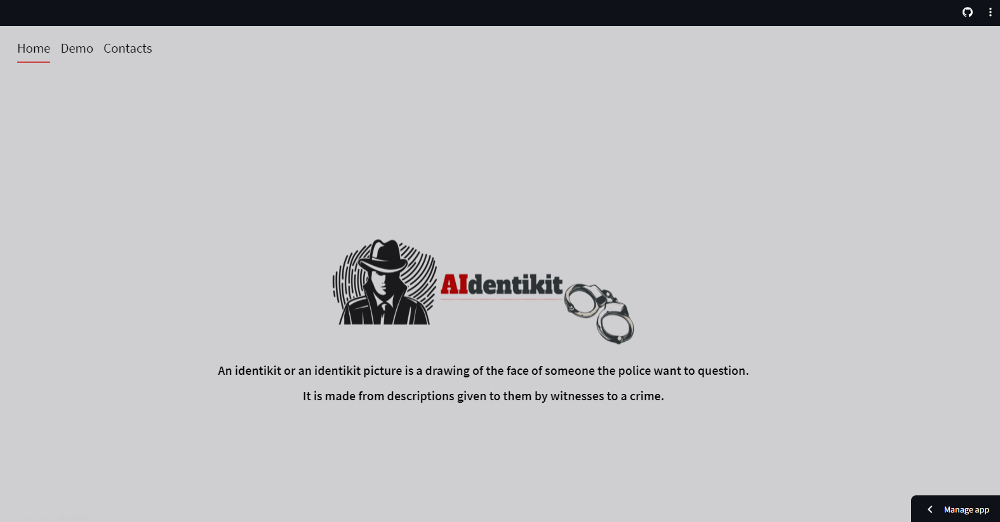

### Readme last update 2023.Sep.6
# Documentation of App "AIdentikit" 
## The app can generate face images from text inputs describing the face features.

Demo Presentation Slide

Webpage(Home)

Webpage(Demo)

# How to run this app locally?
Clone this repository to your local machine, follow the "Preparation" topic and run:
streamlit run app7.py

# Preparation 
Some necessary packages will be imported when running app7.py, style_clip.py, main.py, preprocess.py and process.py.
For example: replicate, request, PIL, os, numpy, etc. (See requirements.txt)

## install in development mode
pip install -e .
## install in production mode
pip install .

## Streamlit
Create a .streamlit folder and put a secrets.toml file inside. 
Go to [replicate](https://replicate.com/), make a account and place the given token in the secrets.toml file in order to run the api.

# How it works?
## app7.py
Create and change the content on the webpage based on user input text using main.py and style_clip.py.

### main.py
From the input text on the webpage call process.py. The process.py call the preprocess.py to handle the input text.
After that, process.py use the preprocess.py information to search a image in the database with the most common attributes described in the input text.

### style_clip.py
With the returned image from main.py, call the replicate api, change the image based on the new input text given by the user and return the information to app7.py

# Note:
If you want to use main.py separatedly, change the user_query variable to some text.

## run command
python main.py

## To see the selected pictures 
goto data/save/ directory

# Modification history
- 2023 Sep 21: updated py files and Readme.md
- 2023 Sep 06: updated py files and Readme.md
- 2023 Aug 30: added a vocabulary dict option in Tfidifvectorization
-            : changed ngram_range(1,2) --> (1,3)
